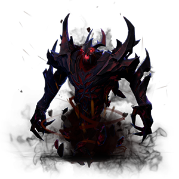

# pro.fessional.nevermore 


[](https://coveralls.io/github/trydofor/professional-nevermore)

> English 🇺🇸 | [中文 🇨🇳](readme-zh.md)

Somewhat Useful Java Annotation Processor



## How to use

``` xml
<dependencies>
    <dependency>
        <groupId>pro.fessional</groupId>
        <artifactId>nevermore</artifactId>
        <version>${nevermore.version}</version>
    </dependency>
</dependencies>
<build>
    <plugins>
        <plugin>
            <groupId>org.apache.maven.plugins</groupId>
            <artifactId>maven-compiler-plugin</artifactId>
            <configuration>
                <parameters>true</parameters>
                <annotationProcessorPaths>
                    <!--  at last -->
                    <path>
                        <dependency>
                            <groupId>pro.fessional</groupId>
                            <artifactId>nevermore-processor</artifactId>
                            <version>${nevermore.version}</version>
                        </dependency>
                    </path>
                </annotationProcessorPaths>
            </configuration>
        </plugin>
    <plugins>
<build>
```

## Conditional @SetterIf

For the `protected` field of `Pojo`, generate subclass with conditional setters
in the same package, such as the following code.

```java
public interface Outer {
    @SetterIf
    class Pojo {
        protected long id;
        protected boolean active;
        protected Enum<?> status;
        protected List<String> items;
    }
}
```

for each field, generate setters with the following style,

```java
public interface $Outer {

    class Pojo extends Outer.Pojo {
        // conditional setId 
        public void setIdIf(Long id, boolean bool) {/*...*/}
        public void setIdIf(Supplier<Long> id, boolean bool) {/*...*/}
        public void setIdIf(Long id, Predicate<Long> bool) {/*...*/}
        public void setIdIf(Long id, Predicate<Long> bool, Supplier<Long>... ids) {/*...*/}
        public void setIdIfNot(Long id, Predicate<Long> bool) {/*...*/}
        public void setIdIfNot(Long id, Predicate<Long> bool, Supplier<Long>... ids) {/*...*/}
        public void setIdIf(UnaryOperator<Long> id) {/*...*/}
        
        // other field setters
    }
}
```

except for the `$` prefix, the subclasses have the same qualified name as parent,

* `$Pojo` - for normal classes, prefix itself
* `$Outer.Pojo` - for inner classes, prefix the topmost class
